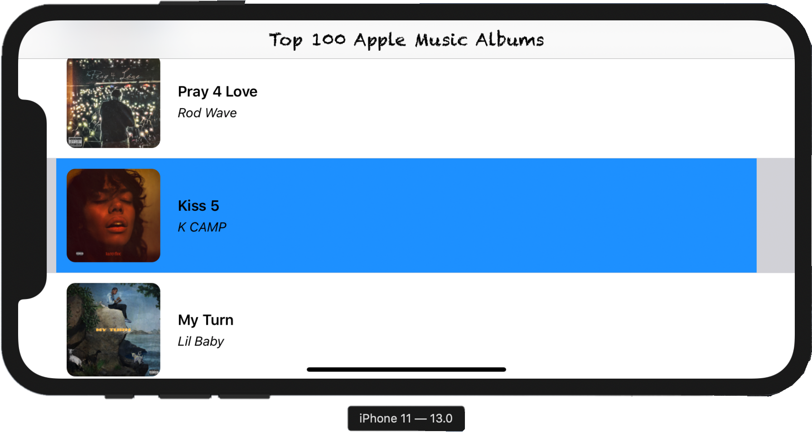

# Apple-Music
This project aims to fullfill Nike coding assigment.

This app is built based on the following criteria:  

## Criteria: 
- MVVM architectureal pattern.

- Programmatically set up all UI elements without using storyboard or nibs. 

- Use Auto Layout to support both Landscape and Portrait mode.

- Is natively built on Swift 5.1 and iOS Developemnt Target 13.0 and not used any third-party libraries. 

- Download 100 music albums across all genres using Apple's RSS generator at [https://rss.itunes.apple.com/en-us](https://rss.itunes.apple.com/en-us).
  
- Contains 2 screens with the folowing specifications: 
	1. **First screen:**
		- Uses UITableView showing one album per cell.
		- Each cell should display the name of the album, the artist, and the album art (thumbnail image). 
    	- Tapping on a cell should push another detail view onto the navigation stack.
	2. **Second screen:**
    	- Should not use UITabelView. 
    	- Contains a larger image at the top of the screen 
    	- Beneath the artwork image, displays the album name, the artist name, genre, release date, and copyright. 
    	- Contains a button that when tapped fast app switches to the album page in the iTunes store.
    	- The button should be centered horizontally and pinned 20 points from the bottom of the view and 20 points from the leading and trailing edges of the view. 
- Unit tests check all the main functionalities of the app and covers 93.8% of AlbumViewModel and cover 72.1% of AlbumInfoViewModel via using the mock data. 
- Using mock JSON options, data loader, nil loader, bad album loader, this app perform mock unit tests on the following modules:
	- Tests for AlbumInfoViewmodel: provides 2 sets of mock data (1 good and 1 bad data) to check if the Album have all the valid properties like: albumname, artistName, genre, releaseDate, copyrightInfo, linkoutUrl to iTunes. 
    - Tests for Album: check if the app can load data into one single Album object and load multiple Album types into an array.
    - Tests for AlbumViewModel: check if the AlbumViewModel can perform networking calls to download JSONdata from Apple API, download image with url endpoint,  perform callback in closure, response to bad image endpoint, response to bad albums (that does not have album name, artitst name,etc), and response to failed loading.  
  
## Extra Features:
- Handling HTTPS status code when perform networking calls.  
- Adding custom color shadow effect on UIView. 
- Adding gradient color for the background on the Detail View Controller 
  via implementing a subclass GradientView and adopting with dynamical AutoLayout View.
- Adding UIAlertController button to display pop-up message when user tap on linkout button 
  and fix the internal Apple animation contraint error.
- Highlight tableViewCell when selected and dehightlight it when deselect it. 
- Provide Auto Layout constraints for each UI element to adapt with vary for traits. 
- Implementing ImageService that can handle the following tasks: 
	- Downloading image using url from Apple API endpoints
    - Applying lock method while downloading the images in the background to avoid race condition in the multithreading environment
    - Caching the frequent used image via saving the image name into cachesDirectory in file system persistently on disk.

## Screenshots 
### Portrait Mode: 

  
 
 
 
 
 
 
 
 
 
 
 
 
 
 
 
 
 
 

### Landscape Mode: 

